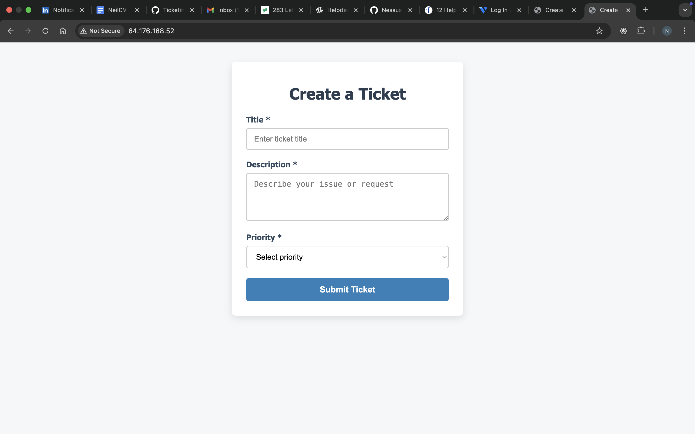
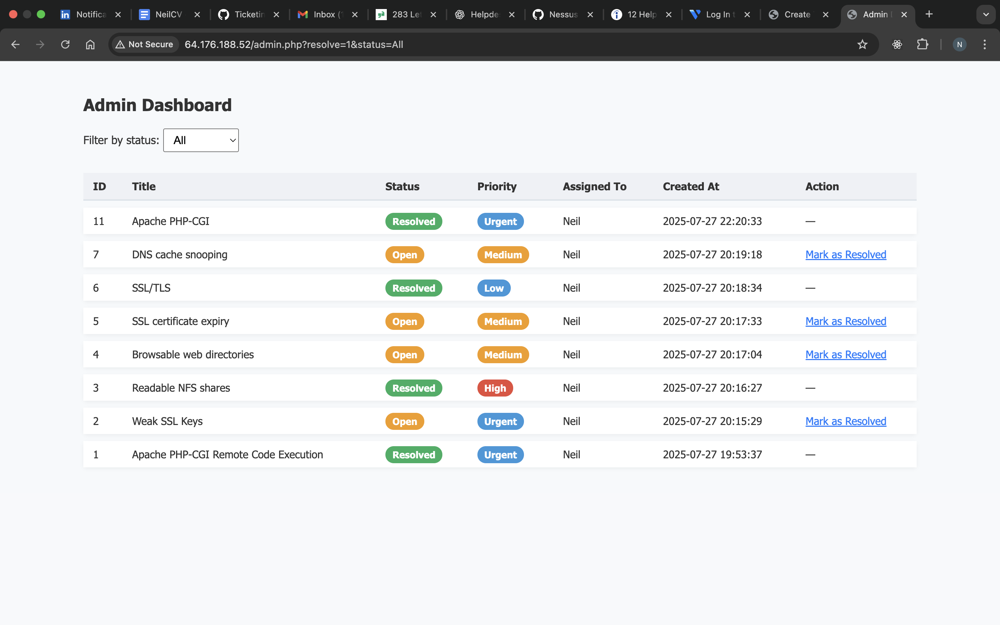
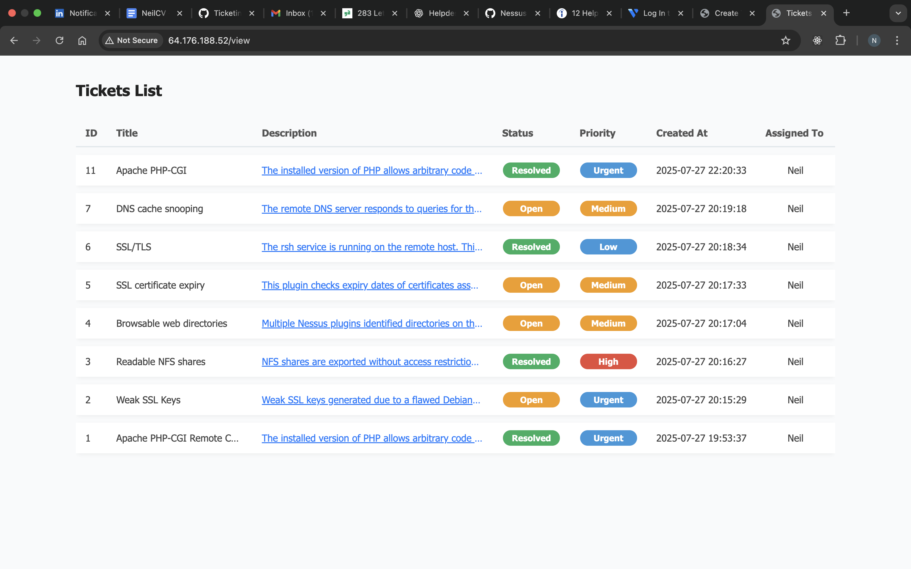

# Ticketing System Project

## Overview

This project is a simple web-based ticketing system designed to simulate the workflow of an IT Helpdesk or Security Operations Center (SOC) analyst. The tickets represent security vulnerabilities discovered from a vulnerability scan on the Metasploitable virtual machine. Each ticket was created to track and manage remediation efforts for these vulnerabilities.

By working through the tickets, I practiced identifying, prioritizing, and resolving security issues — replicating real-world SOC and helpdesk tasks.

---

## Screenshots

### User View - Creating Ticket

  
*View and submit tickets with filtering options.*

### Admin Dashboard

  
*Manage tickets, filter by status, and mark tickets as resolved.*

### Overview of Assignments

  
*See which tickets are open and what user they are assigned to.*

## Features

- Create new tickets with **Title**, **Description**, **Priority**, and **Assigned To** fields.
- View all tickets in a clean, paginated list with status filtering (Open, Resolved, All).
- Admin dashboard to view tickets, filter by status, and mark tickets as resolved.
- Description fields are truncated for easy browsing and expandable to read full details.
- Responsive and user-friendly interface with basic styling.
- Ticket statuses default to "Open" and update dynamically on resolution.
- Tracks ticket creation time (`created_at`).
- Fixed assignment to “Neil” to simulate ticket ownership.

---

## Technologies Used

- PHP for backend logic
- MySQL for database management
- HTML/CSS for frontend interface
- Basic JavaScript for interactivity (description toggle)
- Apache web server (assumed)
- Git for version control

---

## How to Use

1. Clone or download the repository to your web server root directory.
2. Import the provided MySQL schema to create the `tickets` table with necessary fields.
3. Update the database connection settings (`index.php` and `admin.php`) to match your environment.
4. Access the ticket system via your browser:
   - `/` for the user ticket submission
   - `/view` for list view of assignments
   - `/admin` for the admin dashboard with ticket management features
5. Use the forms to add new tickets, view existing ones, and update their status.

---

## Purpose and Learning Outcome

This project was developed as part of my cybersecurity and IT operations practice. It is a hands-on simulation that reflects tasks typically performed by helpdesk personnel or SOC analysts, such as:

- Logging and managing security incidents (tickets)
- Prioritizing vulnerability remediation
- Tracking ticket resolution status
- Working with basic web technologies and databases

Including this project in my CV demonstrates practical experience in vulnerability management workflows and essential skills for IT support and security roles.

---

## Future Improvements

- User authentication and role-based access control
- Email notifications for ticket updates
- Advanced ticket filtering and sorting
- Integration with real vulnerability scanners or SIEM tools
- More detailed audit trails with update timestamps

---

## Contact

For questions or feedback, please contact Neil Gibson via email: 1neilgibson1@gmail.com
